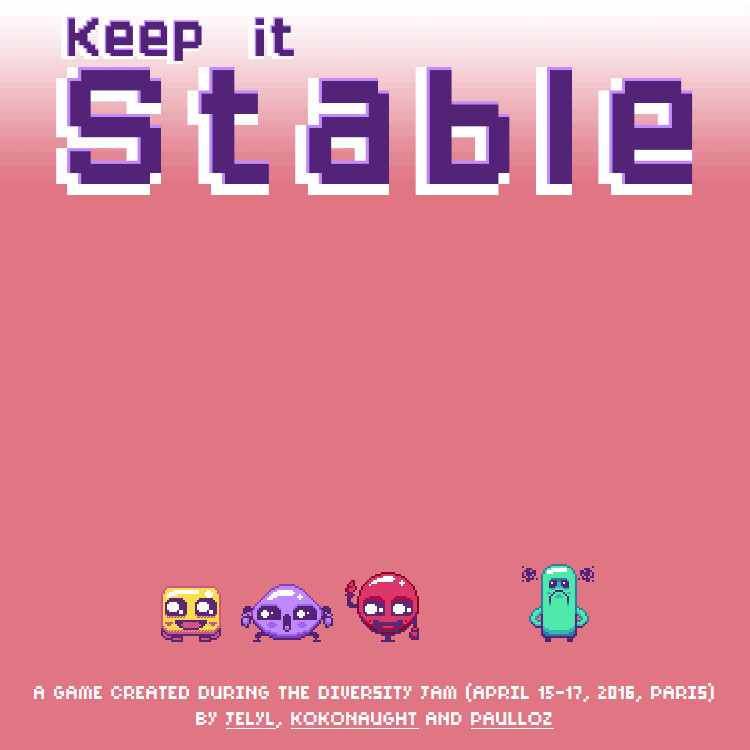

This game was created during the Diversity Jam in Paris (April 15-17, 2016).

Source code is release under [MIT license](https://github.com/mysweetwhomp/diversityjam/blob/master/LICENSE).  

Assets (audio and graphics) are released under the terms of [CC BY-NC-SA 4.0 ](http://creativecommons.org/licenses/by-nc-sa/4.0/).
